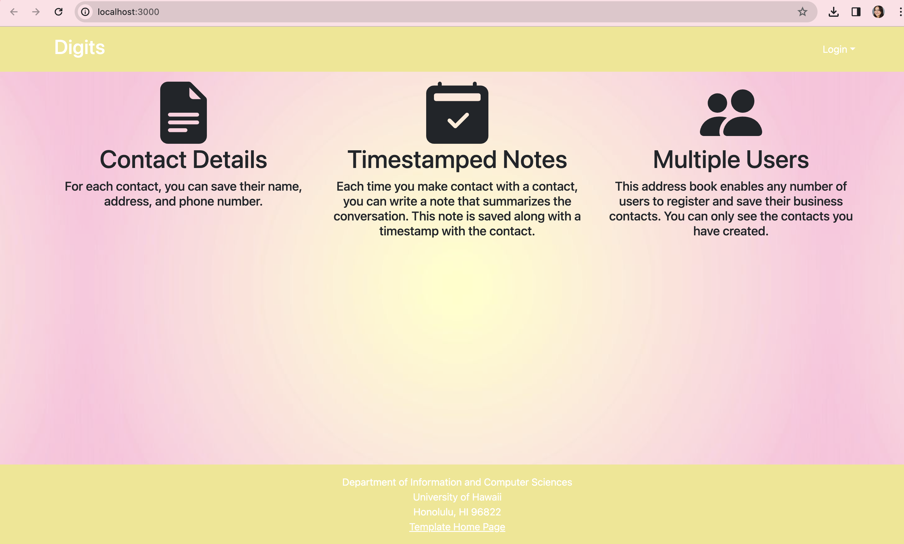
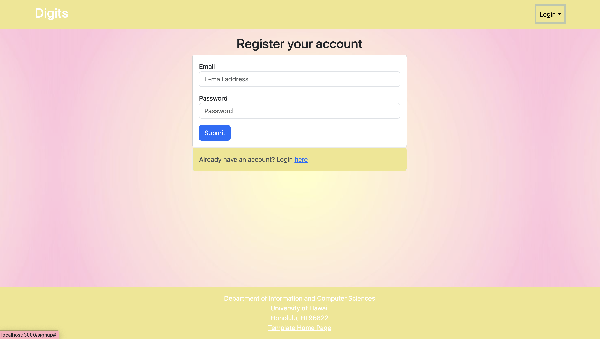
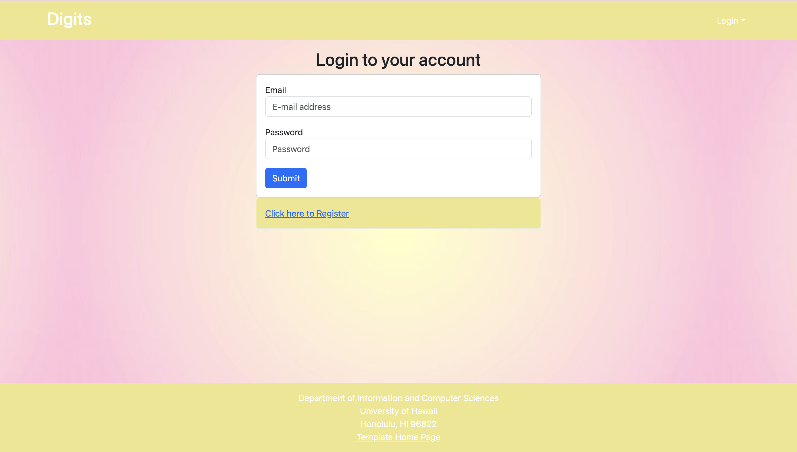

Hellooo! Digits is a simple contact management system that allows users to
register an account, create and manage a set of contacts, and add timestamped notes regarding their interactions with each contact. 


## Installation

To start the Digits application, begin by [installing Meteor](https://www.meteor.com/install).

Once this finishes, go to [Digits](https://github.com/hauolinalani/digits). Click on the green Code dropdown menu and select, open with [GitHub Desktop](https://desktop.github.com/). If using GitHub Desktop,
simply open the application on your preferred IDE as long as it has a terminal, if not, clone the repository to your local file system (Mac, Use Terminal, Windows, use Git Bash).
 
After that, open the terminal and navigate to the app/ directory of your local copy of the repo, and install third-party libraries with:

```
$ meteor npm install
```

Once the libraries are installed, you can run the application by invoking the "start" script in the terminal by using:

```
$ meteor npm run start
```

The first time you run the app, it will create some default users and data. Here is the output:

```
 meteor npm run start 

> meteor-application-template-react@ start /Users/carletonmoore/GitHub/ICS314/meteor-application-template-react/app
> meteor --no-release-check --exclude-archs web.browser.legacy,web.cordova --settings ../config/settings.development.json

[[[[[ ~/GitHub/ICS314/meteor-application-template-react/app ]]]]]

=> Started proxy.                             
=> Started HMR server.                        
=> Started MongoDB.                           
I20220529-12:09:18.384(-10)? Creating the default user(s)
I20220529-12:09:18.389(-10)?   Creating user admin@foo.com.
I20220529-12:09:18.453(-10)?   Creating user john@foo.com.
I20220529-12:09:18.515(-10)? Creating default data.
I20220529-12:09:18.515(-10)?   Adding: Basket (john@foo.com)
I20220529-12:09:18.599(-10)?   Adding: Bicycle (john@foo.com)
I20220529-12:09:18.600(-10)?   Adding: Banana (admin@foo.com)
I20220529-12:09:18.601(-10)?   Adding: Boogie Board (admin@foo.com)
I20220529-12:09:18.773(-10)? Monti APM: completed instrumenting the app
=> Started your app.

=> App running at: http://localhost:3000/
```

Periodically, you might see `Error starting Mongo (2 tries left): Cannot run replSetReconfig because the node is currently updating its configuration` after the `=> Started HMR server.`. It doesn't seem to be a problem since the MongoDB does start.

### Viewing the running app

If all goes well, the template application will appear at [http://localhost:3000](http://localhost:3000).  You can login using the credentials in [settings.development.json](https://github.com/ics-software-engineering/meteor-application-template-react/blob/main/config/settings.development.json), or else register a new account.

### ESLint

You can verify that the code obeys our coding standards by running ESLint over the code in the imports/ directory with:

```
meteor npm run lint
```

## Walkthrough

When you first bring up the application, you will see the landing page that provides a brief introduction to the capabilities of Digits:


## Register
If you do not yet have an account on the system, you can register by clicking on “Login”, then “Sign Up”:


# Log in
If you already have an account, you can log in by clicking on “Login” and entering your credentials:
Click on the Login link, then click on the Signin link to bring up the Sign In page which allows you to login:


## Home page
User home page
After successfully logging in, the system takes you to your home page. 
It is just like the landing page, but the NavBar contains links to list contact and add new contacts:


## List Contacts
Clicking on the List Contacts link brings up a page that lists all of the contacts associated with the logged in user:


This page also allows the user to add timestamped “notes” detailing interactions they’ve had with the Contact. For example:


## Edit Contacts
From the List Contacts page, the user can click the “Edit” link associated with any Contact to bring up a page that allows that Contact information to be edited.


